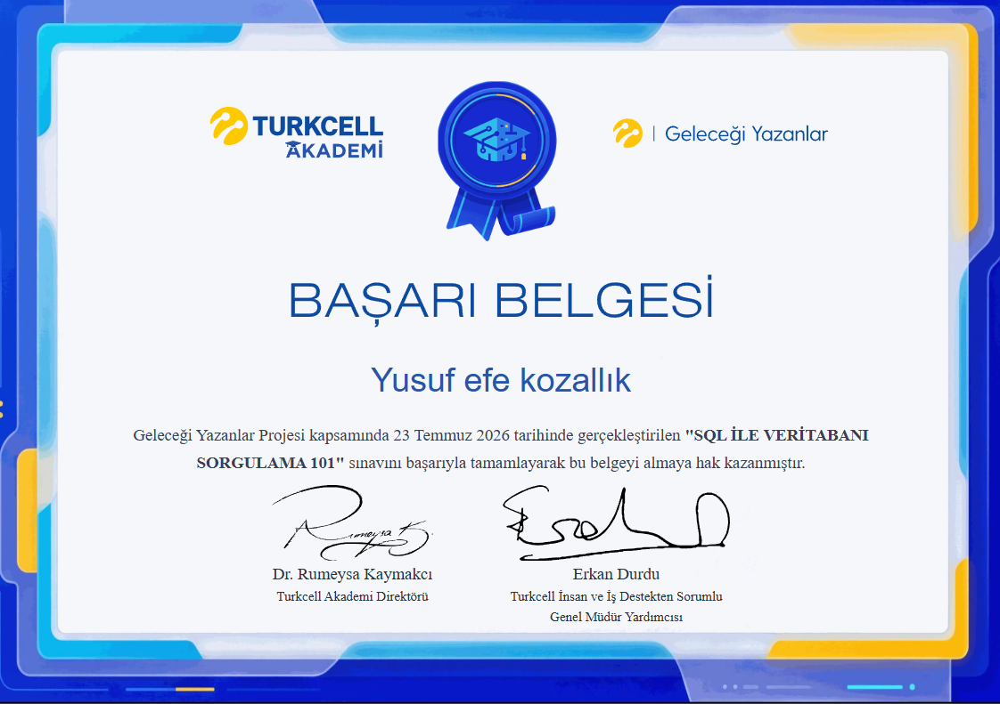

This repository contains setup steps, database theory, T-SQL practical exercises, and the official course certificate for the **SQL Database Querying 101** training provided by Turkcell Academy.

---

## 🎓 Certificate of Achievement

📜 **Official Certificate Verification Link:**  
🔗 [Turkcell Geleceği Yazanlar Certificate Verification Page](https://gelecegiyazanlar.turkcell.com.tr/sertifika/be043de8f9de4e3d8d8e103219b2dea6)

---

## 📚 Course Curriculum & Skills Acquired

### 1. Introduction & Core Concepts
- Fundamentals of Databases and SQL Language
- Relational Database Management Systems (RDBMS)

### 2. Environment Setup & Architecture
- Virtual Machine Concepts: VMWare & Windows Server 2022 Setup
- SQL Server Installation & Configuration
- SQL Server Management Studio (SSMS) Setup & Connection Architecture

### 3. Database Creation & Data Types
- Database Architecture & Fundamentals of Normalization
- Numeric Data Types (Integers & Decimals)
- String Data Types (`CHAR`, `VARCHAR`, etc.)
- Date-Time & Other Specialist Data Types

### 4. DML (Data Manipulation Language) Commands
- `SELECT`: Querying Data
- `INSERT`: Inserting New Records
- `UPDATE`: Updating Existing Data
- `DELETE` vs `TRUNCATE`: Data Removal Architectural Differences

### 5. `WHERE` Clause & Filtering Operators
- Comparison Operators (`=`, `<>`, `>`, `<`)
- Pattern Matching & Range Operators (`LIKE`, `NOT LIKE`, `BETWEEN`, `IN`)
- Logical Operators (`AND`, `OR`, and Combined Usage Logic)
- Conditional `UPDATE` and `DELETE` Operations

### 6. Query Customization & Additional Commands
- `DISTINCT`: Listing Unique/Non-Duplicate Records
- `ORDER BY`: Sorting Query Results (`ASC` / `DESC`)
- `TOP`: Limiting Result Set Size
- `ALIAS`: Column & Table Renaming (`AS`)

### 7. DDL (Data Definition Language) Commands
- `CREATE`: Building Tables & Database Objects
- `ALTER`: Modifying Existing Table Structures
- `DROP`: Removing Tables & Objects

---

*Completion Date: July 23, 2026*
